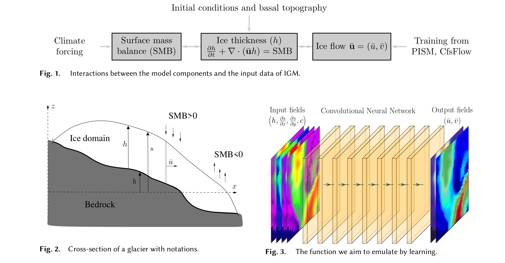
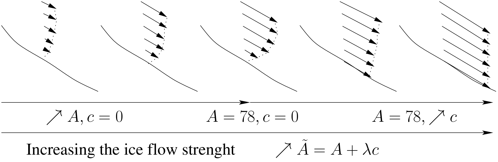

### <h1 align="center" id="title">The Instructed Glacier Model (IGM)</h1>

# Notice 

IGM is a very young code, which has been shortly distributed after the publication of our [paper](https://www.doi.org/10.1017/jog.2021.120) in Journal of Glaciology. More features will come in the next months (e.g., data assimilation). IGM is in a preliminary phase, which aims to illustrate its capacities with simple examples and get feedback from the community. If you have ideas of extensions or applications, you would like to contribute, please contact me first at guillaume.jouvet at unil.ch.

NEW: PhD position in [deep learning-aided glacier modelling](https://career5.successfactors.eu/career?career%5fns=job%5flisting&company=universitdP&navBarLevel=JOB%5fSEARCH&rcm%5fsite%5flocale=en%5fUS&career_job_req_id=19184&selected_lang=en_US&jobAlertController_jobAlertId=&jobAlertController_jobAlertName=&browserTimeZone=Europe/Zurich&_s.crb=yIvxSBQs%2bkpJEU1X4gyBhx6H60O6OKV%2fQFehn7pkJd0%3d).

# Overview   

The Instructed Glacier Model (IGM) simulates the ice dynamics, surface mass balance, and its coupling through mass conservation to predict the evolution of glaciers, icefields, or ice sheets (Figs. 1 and 2). 

The specificity of IGM is that it models the ice flow by a Convolutional Neural Network (CNN), which is trained with state-of-the-art ice flow models (Fig. 3). By doing so, the most computationally demanding model component is substituted by a cheap emulator, permitting speed-up of several orders of magnitude at the cost of a minor loss in accuracy.



IGM consists of an open-source Python code, which runs across both CPU and GPU and deals with two-dimensional gridded input and output data. Together with a companion library of ice flow emulators, IGM permits user-friendly, highly efficient, and mechanically state-of-the-art glacier simulations.

# Installing Python Packages

IGM is written in Python and requires the installation of libraries such as numpy, matplotlib, netCDF4, tensorflow (version 2.4.0 or later), and keras libraries. I recommend creating a dedicated Python environment 'igm' typing the following commands (here we use conda):
 
	conda env create -f igm.yml

or you can do step-by-step with

	conda create --name igm python=3.8
	conda activate igm
	conda install matplotlib numpy netCDF4 
	conda install scipy IPython
	pip install tensorflow==2.4.0   
	pip install keras
	pip install tensorflow-addons
	pip install -U protobuf  # this is necessary for TF 2.5.0
	
Optional: For the best performance, I recommend running IGM on GPU. For that purpose, you need to additionally install i) cuda ii) cudnn iii) tensorflow-gpu. **Make sure that i) cuda ii) cudnn iii) tensorflow iv) python versions are [compatible](https://www.tensorflow.org/install/source#gpu), and your Nvidia driver is [compatible](https://docs.nvidia.com/deploy/cuda-compatibility/) with the version of cuda. Such incompatibility is the most common source of issue.** Here, an example of installation:
 
	conda install cudatoolkit=11.0 cudnn=8.0 -c conda-forge 
	pip install tensorflow-gpu==2.4.0

You may additionally install spyder, which is a nice matlab-looking free editor:

	conda install spyder
	
# Quick start with examples

The best way to get to know IGM is to run given examples. The easiest way is to run notebooks in [](https://colab.research.google.com/github/jouvetg/igm/), which offers free access to GPU. Otherwise, once the above packages have been installed, you may already run ready-to-use examples in the folder `examples/`, which contains input data and scripts with necessary commands. To date, it contains three examples:

- aletsch-simple provides a simple set-up for an advance-retreat simulation of the largest glacier of the European Alps -- Aletsch Glacier, Switzerland -- using a simple parametrization of the mass balance based on time-varying Equilibrium Line Altitudes (ELA), as well as an example of a fully-custumized mass balance routine implementing an oscilitating ELA.

- cluster-simple is simlar to aletsch-simple, but over a wider domain including a tens of glaciers to demonstrate the capability of IGM to model a glacier network.
 
- aletsch-1880-2100 gives the set-up to reproduce the [simulations](https://www.geo.uzh.ch/~gjouvet/the-aletsch-glacier-module/) of the Great Aletsch Glacier (Switzerland) in the [past](https://www.cambridge.org/core/journals/journal-of-glaciology/article/modelling-the-retreat-of-grosser-aletschgletscher-switzerland-in-a-changing-climate/C877413079F73C5FC6131FC7BC031B69) and in the [future](https://www.cambridge.org/core/journals/journal-of-glaciology/article/future-retreat-of-great-aletsch-glacier/EB46DC696E0AB9528168F42595EE23D9) based on the CH2018 climate scenarios and an accumulation/melt model.
 
# About the code

The IGM code is packed into a single file `src/igm.py`, which defines the class `igm` and contains all what we need -- variables and functions -- to run a time evolution glacier model. Just explore it.

IGM core code implements a simple mass balance parametrization based on equilibrium line altitude, accumulation and ablation, vertical gradient, and maximum accumulation rates. More elaborated mass balance models as well as climate forcing can easily advocated to IGM with user-defined functions. 

# The most simple usage

Assuming the necessary input files to be available, the easiest way to run IGM is to run the following comand in a Unix terminal:

	export PYTHONPATH=/your/path/to/IGM/src # or cp /your/path/to/IGM/src/igm.py .
	python -c "from igm import igm ; igm = igm() ; igm.run()" --tstart 0 --usegpu False

which imports the igm class, creates an element of the igm class, and runs it with desired options like `--tstart 0`. The list of options can be checked just adding `--help`. Here are the most important ones:

	  --working_dir         Working directory
	  --model_lib_path      Path of the trained ice flow emulator
	  --geology_file        Geology file name
	  --tstart              Starting time
	  --tend                End time
	  --tsave               Saving frequency
	  --plot_result         Plot results in png when saved (alternative to NetCDF)
	  --plot_live           Plot live the results during computation
	  --usegpu              Use the GPU (recommended if you have one)
	  --cfl                 CFL number for the transport scheme stability (must be below 1)
	  --mb_simple_file      Time-varying parameters of the "simple" SMB model (like ELA)
	  --init_strflowctrl    Initial value of the Strength Flow Control 

# A simple usage with higher control

Alertantively, you may run *python igm-run.py*, where the file *igm-run.py* contains:
```python
from igm import igm 
igm = igm() 
igm.run()
```
or equivalently (this long version provides explicitly all steps of the glacier evolution model, Fig.1):
```python
import tensorflow as tf
from igm import igm
igm = igm()

igm.initialize()  
with tf.device(igm.device_name):
    igm.load_ncdf_data(igm.config.geology_file)
    igm.initialize_fields()               
    igm.initialize_iceflow()
    igm.update_climate()
    igm.update_smb()
    igm.update_iceflow()                    
    igm.update_ncdf_ex()
    igm.update_ncdf_ts()
    igm.print_info()
    while igm.t < igm.config.tend:                       
	igm.update_climate()
	igm.update_smb()
	igm.update_iceflow()
	igm.update_t_dt() 
	igm.update_thk()       
	igm.update_ncdf_ex()
	igm.update_ncdf_ts()
	igm.update_plot()
	igm.print_info()
```

By doing so, one can easily access any igm variables (see the list of variables below) on the fly, e.g., one can plot the ice thickness with the following command:
```python
import matplotlib.pyplot as plt
plt.imshow(igm.thk,origin='lower') ; plt.colorbar()
```

You can also bring own modifications in the loop, e.g., the following line imposes zero mass balance above 4000 m asl. 
```python
igm.smb.assign( tf.where(igm.usurf > 4000, 0, igm.smb) )
```

# TensorFlow

Note that IGM heavily relies on [TensorFlow 2.0](https://www.tensorflow.org/), and most of the relevant glaciological variables (e.g. ice thickness) are TensorFlow tensor objects, which then can be only modified using TensorFlow operations. At first sight, TensorFlow functions may look similar to Numpy, however, the operations between TensorFlow Tensors are in general not as flexible as for Numpy. For the best computational efficiency on GPU, it is crucial to keep all variables and operations within the TensorFlow framework without using numpy (to avoid unnecessary transfers between GPU and CPU memory). For quick testing and if you are unfamiliar with TensorFlow, you can always switch between TensorFlow and numpy objects as follows:
 ```python
import numpy as np
thk_np = igm.thk.numpy()  # tensorflow to numpy
# here you can do numpy operations on thk_np is you wish
thk.assign( thk_np )      # numpy to tensorflow
```

# Advanced usage

For more advanced usage with custumized model components, you may add your own routine by building a new class igm that inherits from igm to keep cores functions as follows:
```python
from igm import igm 
class igm(igm):
    def update_my_field(self):
	  self.myfield.assign( ... )
```

and then include 'igm.update_my_field()' in the time loop above (e.g. between 'igm.update_smb()' and 'igm.update_iceflow()'). In that case you can no longer use the shortcut 'igm.run()'. For custumized mass balance or climate update function, you may do that without modifying the main loop (i.e. keeping 'igm.run()') by defining you own routine named update_smb_mysmb and making sure to activate it by setting the parameter igm.config.type_mass_balance = 'mysmb'. For instance, an implementation of the mass balance function 'sinus' with an oscillating ELA looks like
```python
import tensorflow as tf
import math
from igm import igm 

class igm(igm):

    def update_smb_sinus(self):
	ela = 2800 + 500*math.sin((self.t/50)*math.pi)  # define ELA
	smb = self.usurf - ela
	smb *= tf.where( smb < 0, 0.005, 0.009)  # multiply with ablat. and accum. gradients
	smb = tf.clip_by_value(smb, -100, 2.0)   # clip accumulation to 2 m/y
	self.smb.assign( smb )

igm = igm()
igm.config.type_mass_balance = 'sinus' # do not forget to select the mass balance routine in use
igm.run()
```

# Variable names

Whenever this is possible, IGM adopts the convention name of [PISM](https://pism-docs.org). Here is a minimal list of key variables:

| Variable names |     Shape        | Description                       |
| :------------  | :-------------   | :-------------                    |
| x,y            | (nx)             |  Coordinates vectors              |
| thk            | (ny)             |  Ice thickness                    |
| topg           | (ny,nx)          |  Basal topography (or bedrock)    |
| usurf          | (ny,nx)          |  Surface topography               |
| smb            | (ny,nx)          |  Surface Mass Balance             |
| ubar           | (ny,nx)          |  x- depth-average velocity of ice |
| vbar           | (ny,nx)          |  y- depth-average velocity of ice |
| velbar_mag     | (ny,nx)          |  magnitude of (ubar,vbar)         |
| uvelsurf       | (ny,nx)          |  x- surface velocity of ice       |
| vvelsurf       | (ny,nx)          |  y- surface velocity of ice       |
| velsurf_mag    | (ny,nx)          |  magnitude of (uvelsurf,vvelsurf) |

# Ice flow strenght parametrization

Up to date, ice flow instructor models I used have two critical parameters, which control the ice flow: the sliding coefficient c and the rate factor in Glen's law A, which controls the ice viscosity (it depends on temperature). Always check at the README in the emulator folder.

- Some emulators have been trained with (A,c) evolving within a 2D parameter space so that the emulator takes the two parameters in inputs. The two are called respectively 'arrhenius' and 'slidingco', and therefore must be defined prior any IGM simulations.

- In other cases, I used several A with fixed c=0 (no sliding), and several c with fixed A=78 (a typical value for isothermal ice), and I reduced the parameters (A,c) to a single ice flow strenght control (or 'strflowctrl') defined by A + c. Raising this new parameter permits to describe regimes from nonsliding and low shearing cold ice (low A, c=0) to fast and sliding dominant temperate ice (A=78, and high c), where (A,c)=(78,0) represents a midway value corresponding to nonsliding and shearing temperate ice.



# Input / Output

Preferred and default format for I/O in IGM is NetCDF file. We now shortly describe the input and output files in turn.

- You must provide a file (default name: geology.nc) that contains input data (i.e., initial ice surface and ice thickness) defined on a regular grid, which is kept in IGM for any computations. Note that any additional gridded variables (e.g., called myfield) passed in the input will automatically be converted as a TF Tensor, and be accessible and modifiable as igm.myfield

- IGM records snapshot outputs at regular time intervals (frequency defined by --tsave), with a custumized serie of varibles (which can be custumized changing --vars_to_save) in an output NetCDF file (default: ex.nc). IGM also records time serie variables such as glaciate areas or ice volume.

Note that the [NCO](http://nco.sourceforge.net/) toolkit permits easy operations in command lines, e.g.

       ncks -x -v thk file.nc file.nc              # this removes the variable 'thk' from file.nc
       ncks -v usurf file.nc file.nc               # this extracts the variable usurf from file.nc
       ncap2 -h -O -s 'thk=0*thk' file.nc file.nc  # this does operations on file.nc, here force zero thk
       ncrename -v apc,strflowctrl file.nc         # this renames varible apc to strflowctrl in file.nc

# Available ice flow emulators

You may find trained and reas-to-use ice flow emulators in the folder `model-lib/T_M_I_Y_V/R/`, where 'T_M_I_Y_V' defines the emulator, and R defines the spatial resolution. Make sure that the resolution of the picked emulator is available in the data base. Results produced with IGM will strongly rely on the chosen emulator. Make sure that you use the emulator within the hull of its training dataset (e.g., do not model an ice sheet with an emulator trained with mountain glaciers) to ensure reliability (or fidelity w.r.t to the instructor model) -- the emulator is probably much better at interpolating than at extrapolating. Information of the training dataset is provided in a dedicated README coming along the emulator.

For now, only the emulator trained by CfsFlow is available with different resolutions. If you are unhappy with the proposed list of emulators, consider training your own with the [Deep Learning Emulator](https://github.com/jouvetg/dle).

# Using an emulated mass balance model (experimental)

The structure of IGM facilitates the embeding of further emulators beyond the ice flow model assuming that it maps 2D gridded fields to 2D gridded fields similarly to the ice flow one. This applies to predict surface mass balance from temperature and precipitation fields. IGM permits to embed a neural network emulator to model mass balance. As an illustration, I have trained a Convolutional Neural Network (CNN) from climate and mass balance data from glaciers in the Alps using the [Deep Learning Emulator](https://github.com/jouvetg/dle). To try it, check at the example aletsch-1880-2100. Note that this is highly experimental considering that so far i) the training dataset is small ii) CNN is overkilled here iii) no assessment was done.

# Data assimilation / Invert modelling

A data assimilation module of IGM to seek for optimal ice thickness, top ice surface, and ice flow parametrization, that best explain observational data while being consistent with the ice flow emulator is currently in preparation.

# CPUs, GPUs, and IGM capabilities

In practise, GPUs outperform CPUs most of the time to run IGM, and I therefore advise to activate your GPU if you have one. The expected speed-up of GPUs over CPUs mostly depends on the size of the computational domain. IGM works fine on CPU for small computational domains (typically individual glaciers). In contrast, GPUs will be very advantageous to treat very large computational grids (typically large networks of glaciers) as IGM naturally takes further benefit from parrallelism. So far, I tested IGM with the Nvidia Quadro P3200 and Nvidia RTX 3090 GPUs. The latest is especially interesting to deal with very high resolution computational domain thanks to its large memory. To illustrate this, I modelled the ice dynamics and glacier evolution over New Zealand by forcing the mass balance with an ELA oscillating between 1000 and 2000 meters a.s.l.. The 1000 year-long simulation took about 1.5 hour on the Nvidia RTX 3090 GPU with a 640x700 km computational domain at 200 meters of resolution (i.e. 3200x3500 grid). The animation can be vizualized on this [link](https://youtu.be/Sna673xb-PE).

# Reference

If you use IGM in publications, make sure to cite the code and emulator versions/references you use, as well as the following [paper](https://www.doi.org/10.1017/jog.2021.120).

	@article{IGM,
	  author       = "Jouvet, Guillaume and Cordonnier, Guillaume and Kim, Byungsoo and Lüthi, Martin and Vieli, Andreas and Aschwanden, Andy",  
	  title        = "Deep learning speeds up ice flow modelling by several orders of magnitude",
	  DOI          = "10.1017/jog.2021.120",
	  journal      = "Journal of Glaciology",
	  year         =  2021,
	  pages        = "1–14",
	  publisher    = "Cambridge University Press"
	}

# Acknowledgements

I greatly thank [Guillaume Cordonnier](https://www-sop.inria.fr/members/Guillaume.Cordonnier/) for his valuable help with the TensorFlow implementation. The [Parallel Ice Sheet Model](https://pism-docs.org) has greatly inspired the naming of variables, as well as the format of input and output NetCDF files.

# IGM related Master and PhD project offers

I'm currently seeking for students (at Master or PhD level) to develop IGM. If you are interested, just get in touch with me.

# Contact

Feel free to drop me an email for any questions, bug reports, or ideas of model extension: guillaume.jouvet at unil.ch

